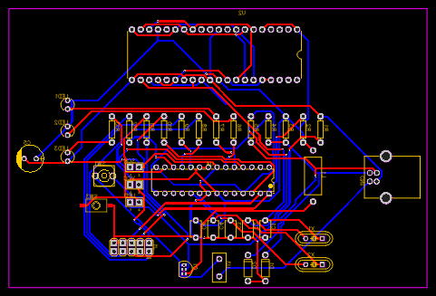

# README
## Programador de AVR
El siguiente proyecto es un programador de AVR, hecho por los estudiantes de Mecatrónica Kenneth Harewood y Jairo González.
Decidimos realizar este proyecto porque queriamos desarrollar una manera económica y fácil de hacer un quemador/programador de AVR. Este programador nos permitirá quemar/programar el avr con un software llamado avrdude.

## Materiales Utilizados
| ID | Name                    | Designator        | Footprint                         | Quantity | Manufacturer Part               | Manufacturer                      | Supplier | Supplier Part |
| -- | ----------------------- | ----------------- | --------------------------------- | -------- | ------------------------------- | --------------------------------- | -------- | ------------- |
| 1  | 1N4448                  | D1,D2             | DO-35                             | 2        | 1N4448                          | SEMTECH                           | LCSC     | C54037        |
| 2  | 100nF                   | C6                | CAP-TH\_L4.8-W3.2-P5.08-D0.5      | 1        | CC4-0805-CG-100V-22pF-J.A       | 火炬                                | LCSC     | C454606       |
| 3  | 22pF                    | C2,C4,C3,C1       | CAP-TH\_L4.8-W3.2-P5.08-D0.5      | 4        | CC4-0805-CG-100V-22pF-J.A       | 火炬                                | LCSC     | C454606       |
| 4  | USB-B-Female-TH\_C46393 | CN1               | USB-B\_TH\_BF90                   | 1        | USB-B-Female-90-TH              |                                   | LCSC     | C46393        |
| 5  | 470uH                   | L1                | IND-TH\_BD5.0-L10.5-P14.50-D0.6   | 1        | CKL0510\*470uH/K-CCA T          | CENKER                            | LCSC     | C354672       |
| 6  | ATMEGA8-16PU            | U4                | DIP-28\_L35.0-W6.5-P2.54-LS7.6-BL | 1        | ATMEGA8-16PU                    | MICROCHIP                         | LCSC     | C112958       |
| 7  | JUMPER2                 | SCK,VCC,UPD       | JUMPER2                           | 3        |                                 |                                   |          |               |
| 8  | EVQ22705R               | SW1               | KEY-6.0\*6.0-4                    | 1        | EVQ22705R                       | PANASONIC                         | LCSC     | C79156        |
| 9  | Green                   | LED2              | LED-3MM/2.54                      | 1        | 204-10SURD/S530-A3              | EVERLIGHT                         | LCSC     | C99772        |
| 10 | Yellow                  | LED3              | LED-3MM/2.54                      | 1        | 204-10SURD/S530-A3              | EVERLIGHT                         | LCSC     | C99772        |
| 11 | Red                     | LED1              | LED-3MM/2.54                      | 1        | 204-10SURD/S530-A3              | EVERLIGHT                         | LCSC     | C99772        |
| 12 | 49S                     | X2,X1             | HC-49S                            | 2        | 49S DIP Crystal insulation film | YXC                               | LCSC     | C35018        |
| 13 | 22uF                    | C5                | CAP-D8.0XF3.5                     | 1        |                                 |                                   |          |               |
| 14 | ZIFSOCKET-40            | U2                | DIL40-6-ZIF\_SOCKET               | 1        |                                 |                                   |          |               |
| 15 | 560                     | R6,R7,R13         | AXIAL-0.3                         | 3        |                                 |                                   |          |               |
| 16 | 10k                     | R2                | AXIAL-0.3                         | 1        |                                 |                                   |          |               |
| 17 | 1k                      | R1                | AXIAL-0.3                         | 1        |                                 |                                   |          |               |
| 18 | 270                     | R8,R9,R11,R10,R12 | AXIAL-0.3                         | 5        |                                 |                                   |          |               |
| 19 | 2.2K                    | R3                | AXIAL-0.3                         | 1        |                                 |                                   |          |               |
| 20 | 68                      | R5,R4             | AXIAL-0.3                         | 2        |                                 |                                   |          |               |
| 21 | AVR\_SPI                | J1                | AVR\_ICSP                         | 1        |                                 |                                   |          |               |
| 22 | K2-1107ST-A4SW-06       | SW3               | K2-1107ST-A4SW-06                 | 1        | K2-1107ST-A4SW-06               | Rectangular Connectors - Contacts | LCSC     | C118141       |
| 23 | 5TE0.5A 250V            | U3                | FUSE-TH\_L8.5-W4.0-P5.08-D0.6     | 1        | 5TE0.5A 250V                    | XC Elec(Shenzhen)                 | LCSC     | C140483       |
| 24 | BC327B                  | Q1                | TO-92-3\_L4.9-W3.7-P1.27-L        | 1        | BC327B                          | CJ                                | LCSC     | C16826        |

## Esquemático

## PCB Layout

## Vista 2D y 3D de la placa
### 2D

### 3D

## Uso del Zif Zocket

## Software Utilizados
Para la creación del esquemático y del pcb layout utilizamos EasyEda, que se puede conseguir desde el siguiente [link](https://easyeda.com/page/download). Y para la instalación de el programa en el avr utilizamos AVRDUDE, que puede ser conseguido desde el siguiente [link](http://download.savannah.gnu.org/releases/avrdude/) .

## Referencias
Aquí adjuntamos un video que utilizamos como guía para crear nuestro proyecto y de como se debe utilizar el avrdude para programar el avr.

